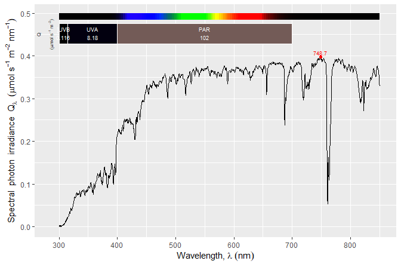

<!-- README.md is generated from README.Rmd. Please edit that file -->

# ooacquire 

## Purpose

Package **‘ooacquire’** makes it possible to control, modify settings
and acquire spectral data directly from within R. It can be also used
off-line to read raw-counts data from files saved by Ocean Insight’s
software and hardware. In both cases it implements the conversion of
raw-counts data into physical quantities, with different protocols to
improve the dynamic range and corrections to reduce stray-light and
other sources of noise.

In sunlight, array spectrometers due to their single monochromator have
a noise floor of three orders of magnitude, which makes it impossible to
measure the UV-B band. With special characterization of the
spectrometer, one of the procedures implemented improve the noise floor
by at least one order of magnitude. With care, this allows reliable
measurement of the spectral irradiance of sunlight at ground level
including UV, VIS and NIR regions.

Package **‘ooacquire’** supports most types of *Ocean Optics*
spectrometers from former *Ocean Optics*, now *Ocean Insight*
(<https://www.oceaninsight.com/>). The free runtime of the [*OmniDriver
SDP*](https://www.oceaninsight.com/products/software/drivers/omnidriver-and-spam/)
and *Java* need both to be installed before data acquisition is
possible. The runtime itself and its documentation can be downloaded at
<https://www.oceaninsight.com/support/software-downloads/>.

## Warning!

Under MS-Windows with RStudio, package ‘RJava’ is not compatible with R
(==4.2.0). It crashes and consequently ‘ooacquire’ cannot be loaded.
Only known solution to this bug is to use R (\<=4.1.3) or R (\>=4.2.1).

## Details

Package **‘ooacquire’** provides high level functions for spectral data
acquisition built using lower level functions from package
**‘rOmniDriver’** as a base. It also provides functions for reading
“raw” (= detector) counts data from files and for computing physical
quantities from detector counts. If package **‘rOmniDriver’** is not
available, **‘ooacquire’** will enter its **off-line** mode in which all
functions that communicate with the spectrometer are disabled or trigger
an error, while other functions will be usable. Thanks to the
**off-line** mode, raw data previously acquired with this package or
with software from Ocean Insight can be processed without the need to
install packages **‘rOmniDriver’** and **‘rJava’** or the **OmniDriver**
drivers from Ocean Insight. Ocean Insight’s **SPAM** library is not used
as all computations are done in function defined in this package using
**R** and **C++**.

Acquisition is very flexible with respect to measuring protocols. It
caters for all steps involved in the acquisition of spectral data from
connecting to the instrument(s) and retrieving information from
non-volatile memory, setting and adjusting acquisition parameters,
acquiring raw counts and converting them into counts per second. It
supports bracketing of the integration time for high dynamic range (HDR)
protocols, both with respect to data acquisition and merging/splicing of
spectra. It also supports protocols in which the total measuring time is
kept constant by adjusting in coordination integration time and number
of scans averaged. It works seamlessly together with package
**photobiology** on which it also depends.

In addition to directly acquiring RAW counts data, raw-counts data can
be read from files with automatic decoding of the corresponding
acquisition metadata from file headers. Files saved by *OceanView* or
*SpectraSuite* software from Ocean Optics, or directly by Jaz
spectrometers can be read. Raw data read from files and acquired
directly is stored in the same format. Consequently, data from either
origin can be used as the starting point for the computation of spectra
expressed as corrected counts-per-second with the same flexibility and
code.

High level functions in this package and in package **photobiology**
allow the easy conversion of counts-per-second into the physical
quantities of interest such as spectral irradiance, spectral
transmittance, spectral reflectance, spectral absorptance and spectral
absorbance.

Functions in **‘ooacquire’** related to data acquisition use the free
*OmniDriver* run-time which in turn requires *Java*. Once these are
installed, there is no other set up needed, just plug a spectrometer to
an USB port. The first time you connect an instrument the operating
system will install the drivers as they are made available by the
*OmniDriver* installation.

Direct acquisition has been tested with our *Maya2000Pro*, *Flame* and
*Jaz* instruments under MS-windows 7 and MS-Windows 10, but can be
expected also to work with any other modern spectrometer from Ocean
Optics, and under OS X, and Linux in addition to MS-Windows. Package
**‘ooacquire’** manages acquisition settings semi-automatically storing
all the settings needed for acquisition into a single data object.
Functions for automatic tuning of integration time are also provided.
Settings used for acquisition of spectra and a descriptor of the
instrument are stored at the time of acquisition as attributes of the
object where the raw counts are stored. These metadata are preserved
through all processing steps. Most of these metadata are also available
in the header of data files created with software from Ocean Insight.
When raw-counts data are read from files, these metadata are read and
saved to the objects together with the data. The aim is to make
traceabilty of the origin of the data automatic.

## Technical aspects

Package **‘rOmniDriver’** makes available in R the API functions from
the *OmniDriver SDP* by wrapping the Java calls in R functions of the
same name and doing argument type conversions when needed. *OmniDriver*
allows to change settings and acquire spectra using most Ocean Optics
USB-connected spectrometer. *As support from some older devices has been
discontinued in recent versions of *OmniDriver*, to use, for example,
the formerly very popular USB2000 spectrometer, it is necessary to
install an old version of *OmniDriver* instead of the current one.*

## Installation of the released version

The package is not hosted in CRAN, but instead at a private “CRAN-like”
repository. In recent versions of R an option can be set to make this
repository visible to R, before installing this package and
‘rOmniDriver’ as usual.

``` r
repos <- getOption("repos", default = list())
repos[["r4photobiology"]] <- "https://r.r4photobiology.info"
options(repos = repos)
```

Installation of Java and OmniDriver should be done first.

1.  **Java JDK** (Java development kit). *The Java run-time is not
    enough!*
2.  **rOmniDriver run-time** from Ocean Optics which is a free download.
    It is the same installer as for the non-free SDP, but if run-time is
    selected during installation no key/password are asked for.
3.  Install ‘ooacquire’ after setting the `repos` option, which ensures
    dependencies will be installed automatically. Once the option is set
    installation is as for packages hosted at CRAN. Using the menu entry
    in RStudio or RGui or the code below.

``` r
install.packages("ooacquire")
```

As long as the `repos` option is set as described above, updates can be
done as for packages hosted at CRAN. Using the menu entry in RStudio or
RGui or the code below.

``` r
update.packages()
```

**Steps 1 and 2 are described in the README file of ‘rOmniDriver’, which
can be found in its [on-line
documentation](https://docs.r4photobiology.info/rOmniDriver/) site. Make
sure to read it, follow step by step the installation, testing success
after each step making sure all the required software is properly
installed before attempting to install ‘ooacquire’.**

## Installation of the under development version

The latest, possibly buggy, development version can be installed from
the Git repository at GitHub. For this we can use package ‘remotes’. As
package’s ‘ooacquire’ although coded mainly in R but includes one
function in C++, the build chain for R packages needs to be installed.
In MS-Windows this is achieved by installing Rtools.

Assuming that R and the build tools are installed the following steps
should be done in sequence:

1.  Install the **Java JDK** (Java development kit). *The Java run-time
    is not enough!*
2.  Install the **rOmniDriver run-time** from Ocean Optics which is a
    free download. It is the same installer as for the non-free SDP, but
    if run-time is selected during installation no key/password are
    asked for.
3.  Install the **R packages** ‘photobiology’, ‘photobiologyInOut’,
    ‘ggspectra’ plus the ‘tidyverse’, all available from CRAN.
4.  Install ‘rOmniDriver’ from GitHub.
5.  Install ‘ooacquire’ from GitHub.

**Steps 1, 2, 3 and 4 are described in the README file of ‘rOmniDriver’,
which can be found in its [on-line
documentation](https://docs.r4photobiology.info/rOmniDriver/) site. Make
sure to read it, follow step by step the installation, testing success
after each step making sure all the required software is properly
installed before attempting to install ‘ooacquire’.**

Installation of the current version from GitHub:

``` r
# install.packages("remotes")
remotes::install_github("aphalo/ooacquire")
```

The package includes calibration data for the spectrometers used in
testing the package and that are used by myself and collaborators. The
last step before being able to use the package is to obtain calibration
data for the spectrometers to be used and their descriptor and saving
them in a suitable format. At least one correction method needs also to
be defined for each spectrometer. Depending on how detailed has been the
characterization of the spectrometer different corrections are possible.
The source package includes a folder ‘data-raw’ with examples of how
this can be done. The process cannot be easily automated as bad pixels
and suitable reference wavelengths need to be chosen based both on the
instrument used and light source to be measured.

## Documentation and examples

Documentation includes six vignettes in addition to help pages. The
examples in the vignettes and help pages use spectral data from
measurements done with this package as well as output files created by
Ocean Optics’s software. These data files are in folder `exdata`.
Scripts containing examples that can be in most cases used with only
small changes are in folder `example-scripts` of this package.

## Examples

A simple example using no dark reference scans.

``` r
library(ooacquire)
folderpath <- system.file("extdata", package = "ooacquire")
file_names <- list(light = paste(folderpath, 
                                 "irrad-files/light-short.txt", sep = "/"))
one_file.spct <- 
  s_irrad_corrected(x = file_names,
                    descriptor = which_descriptor("2016-10-11" , 
                                                  MAYP11278_descriptors),
                    correction.method = MAYP11278_ylianttila.mthd)
autoplot(one_file.spct, unit.out = "photon", range = c(300, 850))
```

<!-- -->

## Non-commercial status

Packages **‘rOmniDriver’** and **‘ooacquire’** are both open source and
released under a GPL license. Neither **‘rOmniDriver’** nor
**‘ooacquire’** require the commercial software *OceanView* or
*SpectraSuite* to be installed, but should be able to coexist with
either of them. They do not require the purchase of any software from
Ocean Optics, but the use of these packages or the free *OmniDriver*
runtime is not supported in any way by Ocean Optics, unless you acquire
a license to the *OmniDriver SDP*. The *OmniDriver SDP* is not open
source and is proprietary software copyrighted by Ocean Optics and
supporting only the use of hardware sold by this company
(<https://oceanoptics.com/>).

## Documentation

HTML documentation for this package is available at
(<https://docs.r4photobiology.info/ooacquire/>), including a *User
Guide* and a description of the algorithms.

The API documentation for the *OmniDriver SDP* is available from Ocean
Insight
[on-line](https://www.oceaninsight.com/globalassets/catalog-blocks-and-images/software-downloads-installers/javadocs-api/omnidriver/index.html "API")
from Ocean Insight.

News about updates are regularly posted at
(<https://www.r4photobiology.info/>).

## Contributing

Please report bugs and request new features at
(<https://github.com/aphalo/ooacquire/issues>). Pull requests are
welcome at (<https://github.com/aphalo/ooacquire>).

## Citation

If you use ‘ooacquire’ to produce scientific or commercial publications,
acknowledge this by citing the package according to:

``` r
citation("ooacquire")
#> 
#> To cite package 'ooacquire' in publications use:
#> 
#>   Aphalo P, Ylianttila L (2023). _ooacquire: Acquire Data from OO
#>   Spectrometers_. https://docs.r4photobiology.info/ooacquire/,
#>   https://github.com/aphalo/ooacquire.
#> 
#> A BibTeX entry for LaTeX users is
#> 
#>   @Manual{,
#>     title = {ooacquire: Acquire Data from OO Spectrometers},
#>     author = {Pedro J. Aphalo and Lasse Ylianttila},
#>     year = {2023},
#>     note = {https://docs.r4photobiology.info/ooacquire/,
#> https://github.com/aphalo/ooacquire},
#>   }
```

## License

© 2016-2023 Pedro J. Aphalo (<pedro.aphalo@helsinki.fi>) for the code.
Lasse Ylianttila developed the majority of the algorithms used. Released
under the GPL, version 2 or greater. This software carries no warranty
of any kind.
