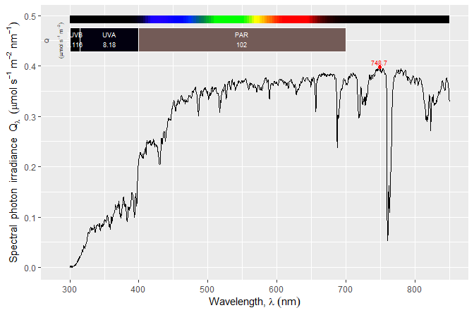

<!-- README.md is generated from README.Rmd. Please edit that file -->

# ooacquire 

<!-- badges: start -->

[](https://aphalo.r-universe.dev/ooacquire)
[](https://github.com/aphalo/ooacquire/actions/workflows/R-CMD-check.yaml)
[](https://docs.r4photobiology.info/ooacquire/)
<!-- badges: end -->

## Purpose

Package **‘ooacquire’** makes it possible to control, modify settings
and acquire spectral data directly from within R. It can be also used
off-line to read raw-counts data from files saved by Ocean Insight’s
software and hardware, or previously acquired with ‘ooacquire’. In both
cases it implements the conversion of raw-counts data into physical
quantities, with different protocols to improve the dynamic range and
corrections to reduce stray-light and other sources of noise.

In sunlight, array spectrometers due to their single monochromator have
a noise floor of three orders of magnitude, which makes it impossible to
measure the UV-B band. With special characterization of the
spectrometer, one of the procedures implemented improves the noise floor
by at least one order of magnitude. With care, this allows reliable
measurement of the spectral irradiance of sunlight at ground level
including UV-B, UV-A, VIS and NIR regions.

The User Guide menu of the [on-line
documentation](https://docs.r4photobiology.info/ooacquire/) includes in
addition to the vignettes included in the package, two on-line only
chapters: [a tutorial on how to measure spectral
irradiance](https://www.r4photobiology.info/pages/acq-irrad-tutorial.html)
with ‘ooacquire’ and a [description of the algorithms
used](https://www.r4photobiology.info/pages/ooacquire-algorithms.html).

Package **‘ooacquire’** supports most types of *Ocean Optics*
spectrometers (<https://www.oceanoptics.com/>). The 64 bit versions of
the free runtime of the *OmniDriver SDP* and *Java* need both to be
installed before data acquisition is possible. The driver is only needed
for live communication, control and data acquisition from within R.

## Discontinuation of OmniDriver by Ocean Optics

**Ocean Optics has discontinued support for *OmniDriver* in mid 2024!**
This means that the runtime has to be downloaded from a “hidden” page in
the Ocean Optics web site at
<https://www.oceanoptics.com/software/resources/discontinued-software/>.
Discontinuation seems to mean that support for newer models will not be
added, while maintenance updates are still regularly released. Multiple
versions of OmniDriver are currently available: 2.80, 2.79, 2.75 and
2.56. Recently released versions do not support very old spectrometer
models such as the USB2000 and HR2000. Version 2.56 is the most recent
one that supports them. Package ‘ooacquire’ works with all versions that
I have tested (2.56, 2.75 and several other).

Package ‘ooacquire’ can be also used without installing OmniDriver, but
in this case only off-line processing of spectra and import of spectral
data from files obtained with other software from OceanOptics are
possible. All functions that connect to spectrometer hardware are
disabled in the absence of an installed OmniDriver driver, while all
functions that do not communicate with the spectrometer remain fully
functional.

Package ‘ooacquire’ accesses spectrometers through functions in R
package ‘rOmniDriver’, which exposes many functions from the OmniDriver
API as R functions. *At some point, I will investigate if SeaBreeze can
be used as a replacement for OmniDriver through a future R package
replacing ‘rOmniDriver’. Basic functionality seems to be well supported
by SeaBreeze, but fast buffered acquisition of spectra does not seem to
be supported. On the other hand, SeaBreeze is open source and written in
C++. A translation of the code in Python is also available. The Python
version should be the easiest to use as Python functions could be
accessed from R code using package ‘reticulate’. However, this approach
can be expected to be slower than calling C++ code through package
‘Rcpp’. I will most likely try to support the Python library at some
point in the future, as it is compatible with more spectrometers,
including the only one I have unrestricted access to: an old USB2000.*

## Warning!

Under MS-Windows with RStudio, package ‘RJava’ is not compatible with R
(==4.2.0). It crashes and consequently ‘ooacquire’ cannot be loaded.
Only known solution to this bug is to use R (\<=4.1.3) or R (\>=4.2.1).

## Details

Package **‘ooacquire’** provides high level functions for spectral data
acquisition built using lower level functions from package
**‘rOmniDriver’** as a base. It also provides functions for reading
“raw” (= detector) counts data from files and for computing physical
quantities from detector counts. If package **‘rOmniDriver’** is not
available, **‘ooacquire’** will enter its **off-line** mode in which all
functions that communicate with the spectrometer are disabled or trigger
an error, while other functions will be usable. Thanks to the
**off-line** mode, raw data previously acquired with this package or
with software from Ocean Insight can be processed without the need to
install packages **‘rOmniDriver’** and **‘rJava’** or the **OmniDriver**
drivers from Ocean Insight. Ocean Insight’s **SPAM** library is not used
as all computations are done in function defined in this package using
**R** and **C++**.

Acquisition is very flexible with respect to measuring protocols. It
caters for all steps involved in the acquisition of spectral data from
connecting to the instrument(s) and retrieving information from
non-volatile memory, setting and adjusting acquisition parameters,
acquiring raw counts and converting them into counts per second. It
supports bracketing of the integration time for high dynamic range (HDR)
protocols, both with respect to data acquisition and merging/splicing of
spectra. It also supports protocols in which the total measuring time is
kept constant by adjusting in coordination integration time and number
of scans averaged. It works seamlessly together with package
**photobiology** on which it also depends.

In addition to directly acquiring RAW counts data, raw-counts data can
be read from files with automatic decoding of the corresponding
acquisition metadata from file headers. Files saved by *OceanView* or
*SpectraSuite* software from Ocean Optics, or directly by Jaz
spectrometers can be read. Raw data read from files and acquired
directly is stored in the same format. Consequently, data from either
origin can be used as the starting point for the computation of spectra
expressed as corrected counts-per-second with the same flexibility and
code.

High level functions in this package and in package **photobiology**
allow the easy conversion of counts-per-second into the physical
quantities of interest such as spectral irradiance, spectral
transmittance, spectral reflectance, spectral absorptance and spectral
absorbance.

Functions in **‘ooacquire’** related to data acquisition use the free
*OmniDriver* run-time which in turn requires *Java*. Once these are
installed, there is no other set up needed, just plug a spectrometer to
an USB port. The first time you connect an instrument the operating
system will install the drivers as they are made available by the
*OmniDriver* installation.

Direct acquisition has been well tested with our *Maya2000Pro*, *Flame*
and *Jaz* instruments under MS-windows 7. MS-Windows 10, and MS-Windows
11, it is known to work under OS X, and can be expected to work also
under Linux distributions. It can be expected to support all modern
spectrometers from Ocean Optics as long as they are supported by the
OmniDriver free runtime.

Package **‘ooacquire’** manages acquisition settings semi-automatically
storing all the settings needed for acquisition into a single data
object. Functions for automatic tuning of integration time are also
provided. Settings used for acquisition of spectra and a descriptor of
the instrument are stored at the time of acquisition as attributes of
the object where the raw counts are stored. These metadata are preserved
through all processing steps. Most of these metadata are also available
in the header of data files created with software from Ocean Insight.
When raw-counts data are read from files, these metadata are read and
saved to the objects together with the data. The aim is to make
traceability of the origin of the data automatic.

## Technical aspects

Package **‘rOmniDriver’** makes available in R the API functions from
the *OmniDriver SDP* by wrapping the Java calls in R functions of the
same name and doing argument type conversions when needed. *OmniDriver*
allows to change settings and acquire spectra using most Ocean Optics
USB-connected spectrometers. *As support for some older devices has been
discontinued in recent versions of OmniDriver*, to use, for example, the
formerly very popular USB2000 spectrometer, it is necessary to install
an old version of *OmniDriver* instead of the current one.

## Installation for data acquisition and conversion

*The ‘ooacquire’ package should be preferably installed after the system
requirements are met by installing drivers and software required at the
operating system level. Please, read carefully the whole installation
instructions before attempting to install this package.*

*Some of the system requirements need to be installed only for direct
connection of spectrometers. If spectral data will be input from files
on disk to do computations rather than acquired from a connected
spectrometer, installation of the OmniDriver runtime, package
‘rOmniDriver’ and their respective dependencies can be skipped.
‘ooacquire’ detects their absence and switches to an “off-line” mode.*

Installation of Java/Temurin and OmniDriver should be done first. Recent
versions of R are only available as **64 bit** binaries. **The versions
of the Java OpenJDK and of OmniDriver to be installed are the 64 bit
ones.**

1.  **Temurin 8 OpenJDK**, **Corretto 8 OpenJDK**, or **Java 8 JDK**
    (Java Open development kit). *The Java run-time is not enough!*
    Temurin OpenJDK and Corretto OpenJDK are free distributions, in
    contrast Oracle’s Java 8 JDK, has some restrictions and is less
    frequently updated.
2.  **rOmniDriver run-time** from Ocean Optics which is a free download,
    but support has been discontinued. It is the same installer as for
    the non-free SDP, but if run-time is selected during installation no
    key/password are required.
3.  Install ‘rOmniDriver’ and ‘ooacquire’ after setting the `repos`
    option, which ensures dependencies will be installed automatically.
    Once the option is set, installation is as for packages hosted at
    CRAN. Using the menu entry in RStudio or RGui or R prompt.

The package is not hosted in CRAN, but instead at “CRAN-like” repository
in the R-Universe serving source packages as well as Windows, OS X
(Apple Mac) and Ubuntu binaries.

In recent versions of R an option can be set to make this repository
visible to R before installing this package and ‘rOmniDriver’ as usual.

``` r
repos <- getOption("repos", default = list())
repos[["r4photobiology"]] <- "https://aphalo.r-universe.dev"
options(repos = repos)
```

``` r
install.packages(c('rOmniDriver', 'ooacquire'))
```

Without setting the option, it is also possible to pass the URL in the
call, together with the CRAN URL to ensure that dependencies are
installed.

``` r
install.packages(c('rOmniDriver', 'ooacquire'), 
                 repos = c('https://aphalo.r-universe.dev', 
                           'https://cloud.r-project.org'))
```

**Steps 1 and 2 are described in the README file of ‘rOmniDriver’, which
can be found in its [on-line
documentation](https://docs.r4photobiology.info/rOmniDriver/) site. Make
sure to read it, follow step by step the installation, testing success
after each step making sure all the required software is properly
installed before attempting to install ‘ooacquire’.**

## Installation for data import and conversion

If ‘ooacquire’ will not be used to connect to a spectrometer, there is
no need to install Ocean Optics’ Omnidiver or package ‘rOmniDriver’.

In recent versions of R an option can be set to make this repository
visible to R before installing this package and ‘rOmniDriver’ as usual.

``` r
repos <- getOption("repos", default = list())
repos[["r4photobiology"]] <- "https://aphalo.r-universe.dev"
options(repos = repos)
```

``` r
install.packages('ooacquire')
```

Without setting the option, it is also possible to pass the URL in the
call, together with the CRAN URL to ensure that dependencies are
installed.

``` r
install.packages('ooacquire', 
                 repos = c('https://aphalo.r-universe.dev', 
                           'https://cloud.r-project.org'))
```

## Installation from GitHub

Installation from sources is also possible directly from the Git
repository at GitHub. **This rarely needed, except to install a non
default branch or from a specific old commit.** The repository [](https://aphalo.r-universe.dev/)
is updated with no more than 1 h of lag to match default branch of
‘ooacquire’ and ‘rOmniDriver’.

Package ‘ooacquire’ although coded mainly in R, includes one function in
C++. Thus, build chain for R packages needs to be installed when
installing it directly from GitHub. In MS-Windows this is achieved by
installing Rtools and in OS X and Linux by installing the tools needed
to build R packages from sources.

Assuming that R and the build tools are installed the following steps
should be done in sequence:

1.  **Temurin 8 OpenJDK**, **Corretto 8 OpenJDK**, or **Java 8 JDK**
    (Java Open development kit). *The Java run-time is not enough!*
    Temurin OpenJDK and Corretto OpenJDK are free distributions, in
    contrast to Oracle’s Java 8, which has some restrictions and is less
    frequently updated.
2.  **rOmniDriver run-time** from Ocean Optics which was until recently
    a free download but has been discontinued. It is the same installer
    as for the non-free SDP, but if run-time is selected during
    installation no key/password are asked for.
3.  Install the **R packages** ‘photobiology’, ‘photobiologyInOut’,
    ‘ggspectra’ ‘rJava’ and ‘tidyverse’, all available from CRAN.
4.  Install ‘rOmniDriver’ from GitHub.
5.  Install ‘ooacquire’ from GitHub.

**Steps 1, 2, 3 and 4 are described in the README file of ‘rOmniDriver’,
which can be found in its [on-line
documentation](https://docs.r4photobiology.info/rOmniDriver/) site. Make
sure to read it, follow step by step the installation, testing success
after each step making sure all the required software is properly
installed before attempting to install ‘ooacquire’.**

Installation of the current version from GitHub:

``` r
# install.packages("remotes")
remotes::install_github("aphalo/rOmniDriver")
remotes::install_github("aphalo/ooacquire")
```

## Setting-up for your own spectrometer

The package includes calibration data for the spectrometers used in
testing the package and that are used by myself and collaborators.
Before ‘ooacquire’ can be used with other spectrometers for measuring
irradaince calibration data and their descriptor has to be available.
The functions fall-back into retrieving calibration data from the
spectrometer when no other calibration or correction methods are
available. This restricts corrections to simpler ones.

When measuring optical properties, transmittance or reflectance,
measurements are relative, and only a wavelength calibration is needed,
and one is almost always retrievable from the spectrometer. The case is
the same for linearization as the polynomial coefficients are also
retrievable from the spectrometer. At least one correction method needs
also to be defined for each spectrometer.

Depending on how detailed has been the characterization of the
spectrometer different corrections are possible. The source package
includes a folder ‘data-raw’ with examples of how this can be done. The
process cannot be easily automated as bad pixels and suitable reference
wavelengths need to be chosen based both on the instrument used and
light source to be measured.

## Documentation and examples

Documentation includes five vignettes in addition to help pages. The
examples in the vignettes and help pages use spectral data from
measurements done with this package as well as output files created by
Ocean Optics’s software. These data files are in folder `extdata`.
Scripts containing examples that can be in most cases used with only
small edits are in folder `example-scripts` of this package.

## Examples

A simple example using no dark reference scans.

``` r
library(ooacquire)
folderpath <- system.file("extdata", package = "ooacquire")
file_names <- list(light = paste(folderpath, 
                                 "irrad-files/light-short.txt", sep = "/"))
one_file.spct <- 
  s_irrad_corrected(x = file_names,
                    descriptor = which_descriptor("2016-10-11" , 
                                                  MAYP11278_descriptors),
                    correction.method = MAYP11278_ylianttila.mthd)
autoplot(one_file.spct, unit.out = "photon", range = c(300, 850))
```

<!-- -->

## Example scripts

The package includes several example scripts, with some of then
containing multiple examples of how functions can be used to acquire
data from spectrometers. users will most likely edit local copies of
these files as the need arises. The list of files can be obtained as
shown below.

``` r
scripts.path <- system.file("example-scripts", package = "ooacquire")
scripts.files <- list.files(scripts.path, full.names = FALSE)
cat(paste(scripts.files, collapse = "\n"))
#> acq-interac-using-triggers.R
#> fluence-acq-interac-acq-options.R
#> irrad-acq-interac-acq-options.R
#> irrad-acq-interac-ui-options.R
#> irrad-acq-script-FLMS.R
#> irrad-acq-script-Luke.R
#> irrad-acq-script.R
#> irrad-acq-series-tests.R
#> irrad-acq-timeseries.R
#> irrad-files.R
#> linearization_test_script.R
#> measure-detector-non-linearity.R
#> transmittance-acq-interac-flash.R
#> transmittance-acq-interac.R
#> transmittance_acq_script.R
```

All files (as shown), or the files of interest, can be copied to the
currently active folder (as shown), or to any folder path, once the
paths to the files are obtained as shown below passing
`full.names = TRUE` in the call to `list.files()`.

``` r
scripts.filepaths <- list.files(scripts.path, full.names = TRUE)
file.copy(from = scripts.filepaths, to = ".")
```

## Non-commercial status

Packages **‘rOmniDriver’** and **‘ooacquire’** are both open source and
released under a GPL license. Neither **‘rOmniDriver’** nor
**‘ooacquire’** require the commercial software *OceanView* or
*SpectraSuite* to be installed, but should be able to coexist with
either of them. They do not require the purchase of any software from
Ocean Optics, but the use of these packages or the free *OmniDriver*
runtime is not supported in any way by Ocean Optics, unless you acquire
a license to the *OmniDriver SDP*. The *OmniDriver SDP* is not open
source and is proprietary software copyrighted by Ocean Optics and
supporting only the use of hardware sold by this company
(<https://oceanoptics.com/>).

## Documentation

HTML documentation for this package is available at
(<https://docs.r4photobiology.info/ooacquire/>), including a *User
Guide* and a description of the algorithms.

The API documentation for the *OmniDriver SDP* is available from Ocean
Insight
[on-line](https://www.oceaninsight.com/globalassets/catalog-blocks-and-images/software-downloads-installers/javadocs-api/omnidriver/index.html "API").

News about updates are regularly posted at
(<https://www.r4photobiology.info/>).

## Folder Structure

The folder structure of the Git repository is shown below. Folders
`pkgdown`, `inst-not`, `data-raw` and `tests-scripts-interactive` are
not included in the built package. Folder `data-raw` also contains raw
calibration data and R scripts used to convert them into the objects
included in folder `data`. Folder `tests-scripts-interactive` contains R
scripts used to test data acquisition with specific spectrometers used
during development. Other folders are the usual ones for R packages:
`src` contains C++ code sources based on R package ‘Rcpp’, folder
`packadown` contains bitmaps and other files used in the HTML version of
the documentation, and folder `test` files implementing unit tests for
functions and objects that do not require special hardware, i.e.,
spectrometers, for execution.

    oacquire
    ├── .github 
    ├── data
    ├─┬ data-raw
    │ └── <calibration data in original format and scripts>
    ├─┬ inst
    │ ├── example-scrips
    │ └── extdata
    ├─┬ inst-not
    │ └── <example data not included in package build>
    ├── man 
    ├── pkgdown
    ├── R
    ├── src
    ├── test-scripts-interactive
    ├─┬ tests
    │ └── testthat
    └── vignettes

## Contributing

Please report bugs and request new features at
(<https://github.com/aphalo/ooacquire/issues>). Pull requests are
welcome at (<https://github.com/aphalo/ooacquire>).

## Citation

If you use ‘ooacquire’ to produce scientific or commercial publications,
acknowledge this by citing the package according to:

``` r
citation("ooacquire")
#> To cite package 'ooacquire' in publications use:
#> 
#>   Aphalo P, Ylianttila L (2026). _ooacquire: Acquire Data from OO
#>   Spectrometers_. R package version 0.5.5,
#>   <https://docs.r4photobiology.info/ooacquire/>.
#> 
#> A BibTeX entry for LaTeX users is
#> 
#>   @Manual{,
#>     title = {ooacquire: Acquire Data from OO Spectrometers},
#>     author = {Pedro J. Aphalo and Lasse Ylianttila},
#>     year = {2026},
#>     note = {R package version 0.5.5},
#>     url = {https://docs.r4photobiology.info/ooacquire/},
#>   }
```

## License

© 2016-2026 Pedro J. Aphalo (<pedro.aphalo@helsinki.fi>) for the code.
Lasse Ylianttila developed the majority of the algorithms used. Released
under the GPL, version 2 or greater. This software carries no warranty
of any kind.
